# Year Up United / Pluralsight - Final Capstone
## Course Taught By: Maaike Van Putten

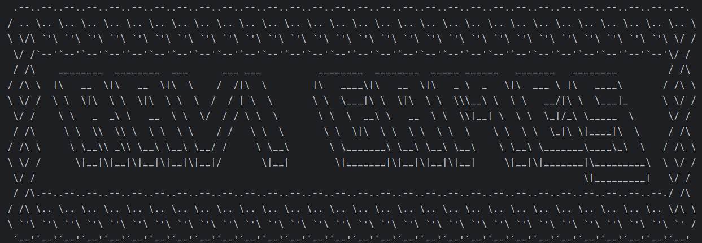

### 🛠️ Tools Used
 /  <br>
 / -4479A1.svg?logo=mysql&logoColor=white) <br>
 ,  <br>
 ,  <br>
 ,  <br>

| Active/Inactive                                                   | Active Dates            |
|-------------------------------------------------------------------|-------------------------|
|  | 12/12/2025 - 12/18/2025 |

### 📝 Description
My final capstone project. A browser-contained web store that offers video games and accessories to users. <br>
The PDF containing the capstone writeup cannot be uploaded due to Pluralsight ownership rights. <br>
Throughout this documentation file you will find brief descriptions of parts of this project, which will give a better idea of its functions and the final capstone writeup requirements. <br>

#### 🕒 Commits History Here<br>
[Development Branch Here](https://github.com/gitraspigner/final-capstone/commits/development) <br>
[Master Branch Here](https://github.com/gitraspigner/final-capstone/commits/master) <br>
#### 📋 Project Boards Here<br>
[Click Here](https://github.com/gitraspigner?tab=projects) <br>

### 💭 Capstone Detailed: <br>

---
### Capstone 3
  ## **Capstone Title:** Web Store (Video Game Store - Ravi Games (Website))
 - **Description:** A browser-contained web store that offers video games and accessories to users.
 - **Application Screens:**
  - **Home** <br>
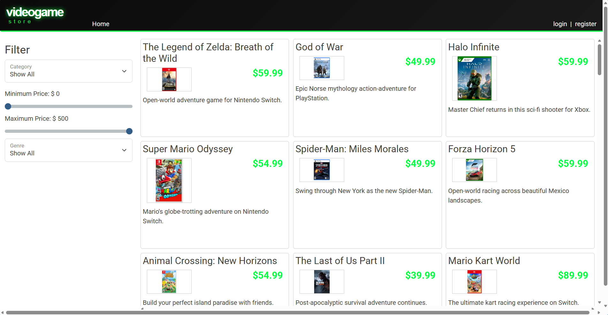
  - **Product Filters Applied (Category, Subcategory, Price)** <br> <br>
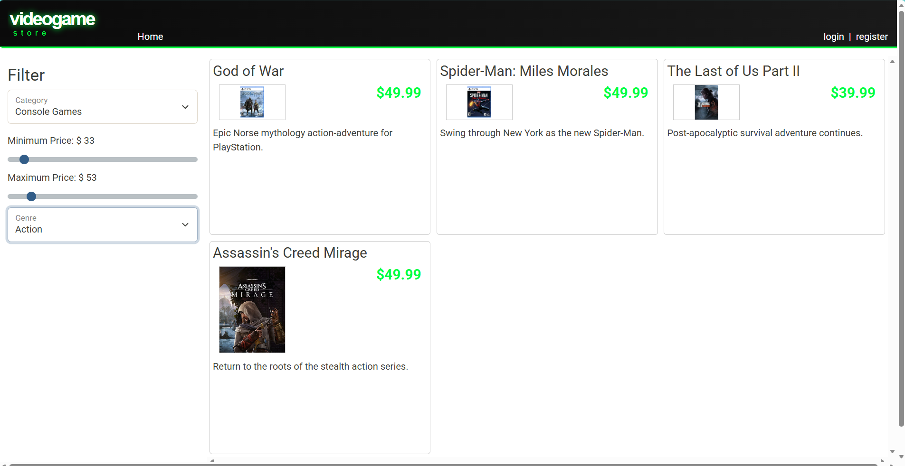
  - **Login Form** <br> <br>
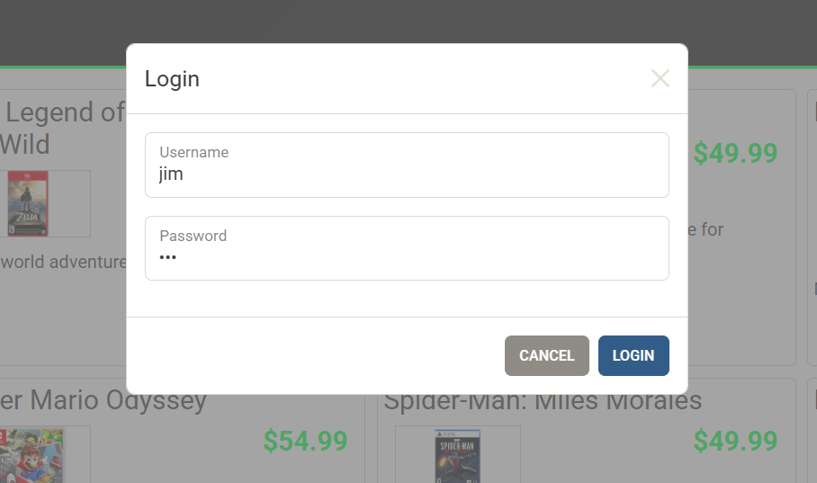
  - **Register Form** <br> <br>
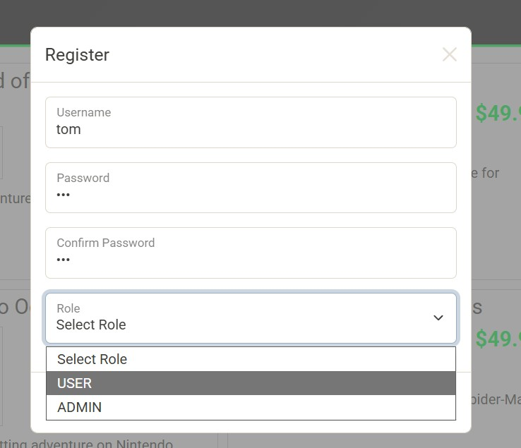
  - **Register (Buttons Shown)** <br> <br>
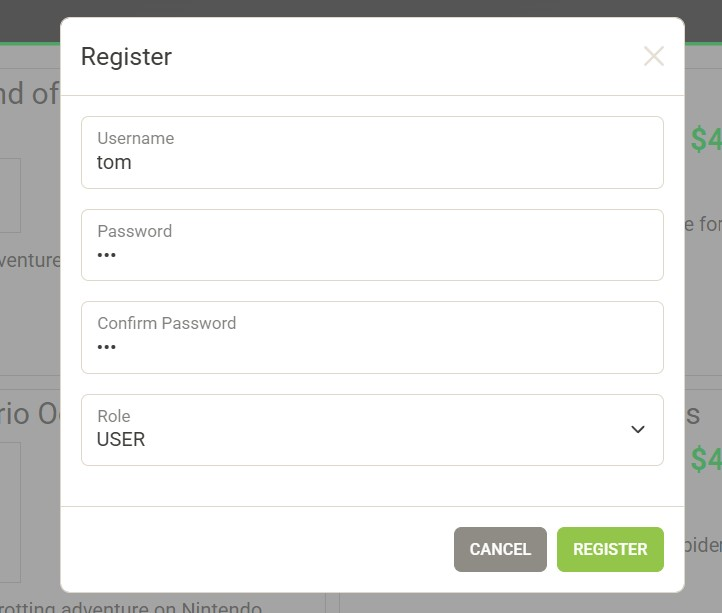
  - **Cart View (Logged In, Multiple Items Added To Cart)** <br> <br> 
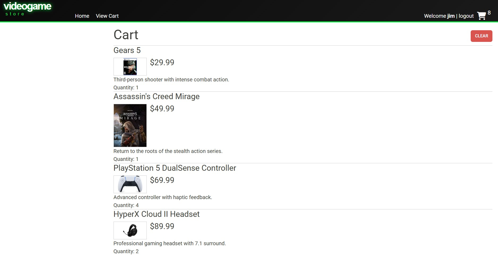
 - **Interesting Code Snippet (from templates/home.html):**

  ```html
<div>
    <label for="min-price" class="form-label">Minimum Price: $ <span id="min-price-display">0</span></label>
    <input type="range" class="form-range" id="min-price" min="0" max="200" value="0" onchange="setMinPrice(this)">
</div>
<div>
    <label for="max-price" class="form-label">Minimum Price: $ <span id="max-price-display">200</span></label>
    <input type="range" class="form-range" id="max-price" min="0" max="200" value="200" onchange="setMaxPrice(this)">
    </div>
  ```
 - **Why it's interesting:**
  - Above contains a few frontend bugs I found in the starter code provided for this capstone. This defines the content of the 2 sliders used to filter products by lower and upper price limits on the site. <br>
  - The first issue is that the second slider should read 'Maximum Price' but reads 'Minimum Price' instead, which is confusing to the user since they wouldn't know which one was the slider for the maximum price of a product (despite the fact that uses the setMinPrice function), both sliders just say minimum. <br>
  - The second issue is that the maximum values of each slider were not capable of fetching the most expensive items in inventory. These had to be adjusted to the upper limit of 500 (Dollars) so that items above 200 (Dollars) could be retrieved. <br>
  - Below you will find the corrected snippet included in the final version of home.html.
  ```html
<div>
    <label for="min-price" class="form-label">Minimum Price: $ <span id="min-price-display">0</span></label>
    <input type="range" class="form-range" id="min-price" min="0" max="500" value="0" onchange="setMinPrice(this)">
</div>
<div>
    <label for="max-price" class="form-label">Maximum Price: $ <span id="max-price-display">500</span></label>
    <input type="range" class="form-range" id="max-price" min="0" max="500" value="500" onchange="setMaxPrice(this)">
</div>
  ```

- **Tests Included (Controller Classes - Spring):**
 - Categories Controller
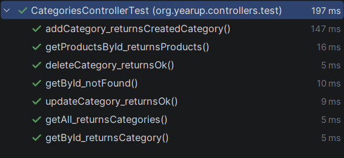
 - Shopping Cart Controller
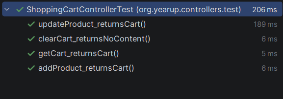

- **Testing Endpoint Requests (using JSON and Insomnia):**
- Retrieve Categories
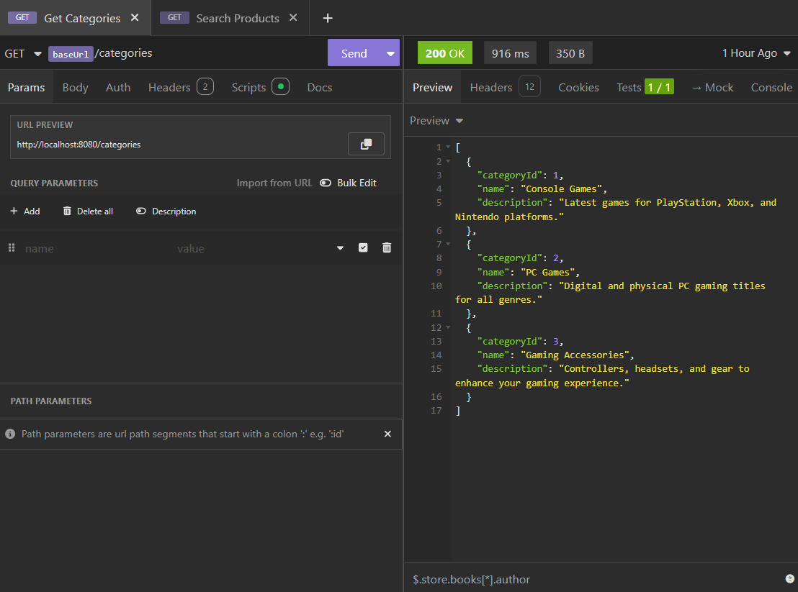
- Product Search
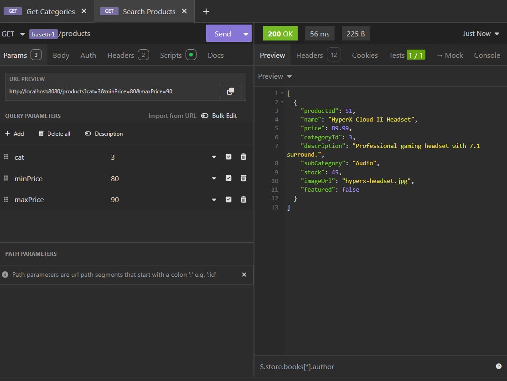

- **Extra Features:**
 - Multiple Cart Items (reflected across site UI)
 - Account Registration (feature included and UI entry form supported)
 - User Cart Saved Between Sessions
 - Custom Console Startup Banner (very minor, not included in site UI)

- **Additional Thoughts:**
 - Here are several features I wanted to implement, but was unable to due to time constraints:
  - Update the project to use Spring JPA (to utilize existing Spring implementation for database access)
  - Add an admin-role account deletion feature to site UI (the backend does in fact currently support this)
  - Add a cart/order checkout feature to site UI (backend)
  - Add profile info display to site UI (also currently backend-supported)

---

### 🔖 Citation
I wrote this README.md, but I did indeed use ChatGPT to give my initial framework and to learn markdown formatting. Therefore here is an APA Style Citation for it:  <br>
OpenAI. (2025). ChatGPT (Oct 1 version) [Large language model]. https://chatgpt.com/ <br>

*I have to give credit where it's due, right?* <br>

**Last Edited: 12/18/2025**
